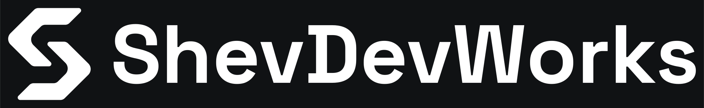
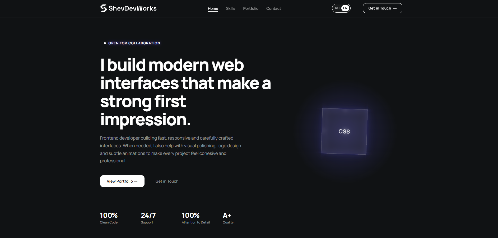
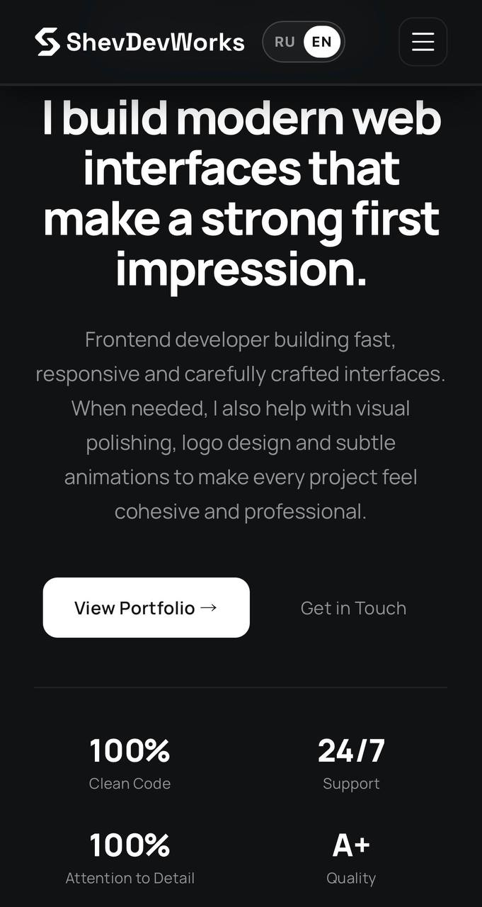

<div align="center">

<picture>
  <source media="(prefers-color-scheme: dark)" srcset="img/logo-horizontal.svg">
  
</picture>

<br><br>

Frontend developer portfolio — modern web interfaces, clean code, pixel-perfect layouts.

**[View the live site →](https://shevdevworks.github.io/portfolio/)**

</div>

---

## Overview

Personal developer portfolio — a single-page site built from scratch with plain HTML, CSS and JavaScript: no frameworks, no build step. Fully bilingual (RU/EN), responsive, and built on a strict brand system (see [Brand & Design](#brand--design)).

## Features

- **RU / EN toggle** — instant language switch, persisted in `localStorage`, auto-detected from the browser on first visit.
- **Brand-consistent design system** — a fixed 4-color palette, defined type scale, and a single accent reserved for glow effects only.
- **Interactive 3D cube** — pure CSS, auto-rotating, respects `prefers-reduced-motion`.
- **Scroll-reveal animations** via `IntersectionObserver` — no scroll-jank.
- **One-click email copy** with inline confirmation feedback.
- **Fully responsive** — dedicated mobile nav, fluid type via `clamp()`, tested down to small phones.
- **Accessible** — semantic landmarks, `aria-*` labels wired to the language toggle, WCAG AA text contrast.
- **SEO-ready** — Open Graph / Twitter Card meta, canonical URL, descriptive alt text.

## Screenshots

| Desktop | Mobile |
|:--:|:--:|
|  |  |

## Tech Stack

| Layer      | Choice                                   |
|------------|-------------------------------------------|
| Markup     | Semantic HTML5                             |
| Styling    | CSS3 (Grid, Flexbox, custom properties)    |
| Behavior   | Vanilla JavaScript (ES6+), no dependencies |
| Fonts      | [Space Grotesk](https://fonts.google.com/specimen/Space+Grotesk) (wordmark) · [Manrope](https://fonts.google.com/specimen/Manrope) (UI text) |
| Hosting    | GitHub Pages                               |

No build tooling, no package manager — open `index.html` and it runs.

## Brand & Design

The site follows the ShevDevWorks brand guidelines: a strictly monochrome palette, applied consistently across every component.

| Token           | Hex       | Role                              |
|-----------------|-----------|------------------------------------|
| `--color-ink`   | `#1E2327` | Primary mark / text on light       |
| `--color-paper` | `#FFFFFF` | Light surfaces, inverted mark      |
| `--color-void`  | `#101214` | Site background (dark theme)       |
| `--color-slate` | `#6B7280` | Secondary text, icons, decoration  |

A single purple glow (`#635bff`) is the one deliberate exception — reserved exclusively for ambient/pulse effects (badge pulse, hover glows), never used for fills, borders, links, or text.

## Featured Projects

The portfolio showcases three of my projects:

| Project | Description | Live | Source |
|---|---|---|---|
| **ApexSaaS** | Interactive automation platform — GSAP animations, reusable UI components | [Demo](https://shevdevworks.github.io/apex-saas/) | [Code](https://github.com/shevdevworks/apex-saas) |
| **Trendify** | Marketplace analytics dashboard — interactive charts, data filtering | [Demo](https://shevdevworks.github.io/trendify/) | [Code](https://github.com/shevdevworks/trendify) |
| **CyberGear** | Custom peripherals e-commerce store — cart, filtering, state management | [Demo](https://shevdevworks.github.io/cyber-gear/) | [Code](https://github.com/shevdevworks/cyber-gear) |

## Getting Started

No dependencies, no build step.

```bash
git clone https://github.com/shevdevworks/portfolio.git
cd portfolio
```

Then either open `index.html` directly in a browser, or serve it locally:

```bash
npx serve .
# or
python -m http.server 8000
```

## Project Structure

```
portfolio/
├── index.html                     # entire site: markup, styles, and script
├── img/
│   ├── favicon.svg / apple-touch-icon.png
│   ├── logo-horizontal.svg        # white version — dark backgrounds
│   ├── logo-horizontal-ink.svg    # ink version — light backgrounds
│   ├── og-image.png               # social sharing card (meta tags only)
│   ├── screenshot-desktop.png     # README preview — desktop
│   ├── screenshot-mobile.png      # README preview — mobile
│   └── *-screen.jpg               # project preview screenshots
└── README.md
```

## Contact

- **Email:** [shevdevworks@gmail.com](mailto:shevdevworks@gmail.com)
- **Telegram:** [@shevdevworks](https://t.me/shevdevworks)
- **GitHub:** [@shevdevworks](https://github.com/shevdevworks)

---

<div align="center">
  <sub>© 2026 ShevDevWorks — Where design meets development.</sub>
</div>
